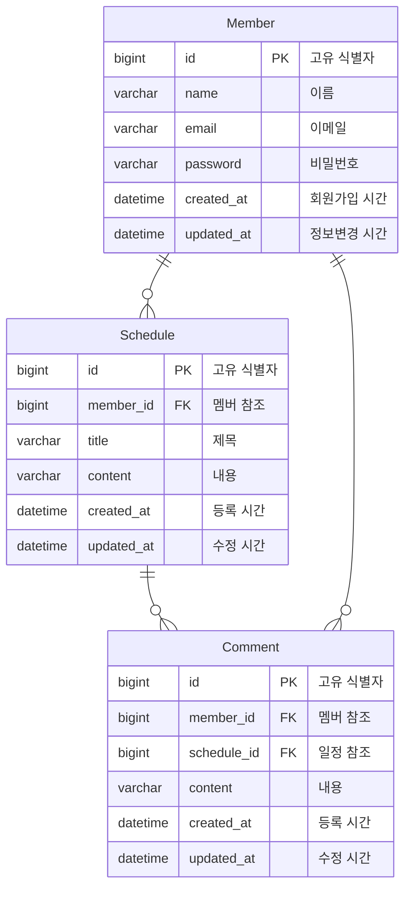

# 일정 관리 API 서버

- [소개](#소개)
- [구현 과정](#구현-과정)
- [ERD](#ERD)
- [API 명세](#API-명세)

## 소개

이 프로젝트는 Spring Data JPA를 사용하여 MySQL DB에 접근하며,
회원과 일정 및 댓글에 대한 CRUD (생성, 조회, 수정, 삭제) 작업을 수행하는 RESTful
API를 제공합니다.

- 프로젝트 기간: 2024.12.11 ~ 2024.12.19
- 기술 스택:
    - Java 17
    - Spring Boot 3.4.0
    - Spring Data JPA
    - MySQL 8.0

## 구현 과정

아래 링크를 통해 각 단계별 브랜치로 이동하여 코드를 확인하실 수 있습니다.

| 단계                                                                                                   | 내용                                                              |
|------------------------------------------------------------------------------------------------------|-----------------------------------------------------------------|
| [Level 1, 2](https://github.com/yeongbinim/JpaSchedulerProject/tree/lv2_schedule-and-member-crud)ㅤㅤㅤ | (🎁 feature) **사용자와 일정을 CRUD 할 수 있다.**                          |
| [Level 3, 4](https://github.com/yeongbinim/JpaSchedulerProject/tree/lv4_register-and-login)ㅤㅤㅤ       | (🎁 feature) **로그인 / 회원가입을 통해 권한을 인증할 수 있다 (Cookie & Session)** |
| [Level 5](https://github.com/yeongbinim/JpaSchedulerProject/tree/lv5_exception)ㅤㅤㅤㅤ                  | (🎁 feature) **예외 발생에 대한 적절한 코드를 응답하고, 요청에 대해 검증한다**            |
| [Level 6, 7](https://github.com/yeongbinim/JpaSchedulerProject/tree/lv7_comment-crud)ㅤㅤㅤㅤ            | (🎁 feature) **사용자는 특정 일정에 댓글을 CRUD 할 수 있다.**                   |
| [Level 8](https://github.com/yeongbinim/JpaSchedulerProject/tree/lv8_paging-schedule)ㅤㅤㅤㅤ            | (🛠 refactor) 일정 조회시 여러 페이지로 나눔 (Page, Pageable)                |

[[고민 해결 과정 보러가기]](READPROCESS.md)

## ERD

## API 명세

<code>/auth</code>

<table>
<thead>
<tr>
<th>METHOD</th>
<th>URI</th>
<th>DESCRIPTION</th>
<th>REQUEST</th>
<th>RESPONSE</th>
</tr>
</thead>
<tbody>
<tr>
<td><code>POST</code></td>
<td>/auth/register</td>
<td>회원 가입</td>
<td>
<pre>{
  "name": "yeim",
  "email": "yeim.dev@yeim.com",
  "password": "password"
}</pre>
</td>
<td>
201 Created
 <code>Location: /api/members/1</code>
 <code>Set-Cookie: JSESSIONID=; Path=/; HttpOnly</code>
</td>
</tr>
<tr>
<td><code>POST</code></td>
<td>/auth/login</td>
<td>로그인</td>
<td>
<pre>{
  "email": "yeim.dev@yeim.com",
  "password": "password"
}</pre>
</td>
<td>
200 OK
 <code>Set-Cookie: JSESSIONID=; Path=/; HttpOnly</code>
</td>
</tr>
</tbody>
</table>

<code>/api/schedules</code>

<table>
<thead>
<tr>
<th>METHOD</th>
<th>URI</th>
<th>DESCRIPTION</th>
<th>요청</th>
<th>응답</th>
</tr>
</thead>
<tbody>
<tr>
<td><code>POST</code></td>
<td>/api/schedules</td>
<td>일정 생성</td>
<td>
<code>Cookie: JSESSIONID=</code>
<pre>{
  "title": "입력 제목",  
  "content": "입력 데이터"
}</pre>
</td>
<td>
201 Created
 <code>Location: /api/schedules/1</code>
</td>
</tr>
<tr>
<td><code>GET</code></td>
<td>/api/schedules</td>
<td>모든 일정 조회</td>
<td><code>Cookie: JSESSIONID=</code></td>
<td>
200_OK
<pre>{
  "content": [{
    "id": 1,
    "author": "yeim",
    "title": "입력 제목",
    "content": "입력 데이터",
    "createdAt": "2024-12-06T20:39:46",
    "updatedAt": "2024-12-10T01:42:57"
  }, ...],
  "pageable": {...},
  "last": true,
  "totalPages": 2,
  "totalElements": 14,
  "first": false,
  "size": 10,
  "number": 1,
  "sort": {...},
  "numberOfElements": 4,
  "empty": false
}</pre>
</td>
</tr>
<tr>
<td><code>GET</code></td>
<td>/api/schedules/{id}</td>
<td>특정 일정 조회</td>
<td><code>Cookie: JSESSIONID=</code></td>
<td>
200 OK
<pre>{
  "id": 1,
  "author": "yeim",
  "title": "입력 제목",
  "content": "입력 데이터",
  "createdAt": "2024-12-06T20:39:46",
  "updatedAt": "2024-12-10T01:42:57"
}</pre>
</td>
</tr>
<tr>
<td><code>PUT</code></td>
<td>/api/schedules/{id}</td>
<td>일정 수정</td>
<td>
<code>Cookie: JSESSIONID=</code>
<pre>{
  "title": "수정된 제목",  
  "content": "수정된 데이터"
}</pre>
</td>
<td>
200 OK
<pre>{
  "id": 1,
  "author": "yeim",
  "title": "수정된 제목",
  "content": "수정된 데이터",
  "createdAt": "2024-12-06T20:39:46",
  "updatedAt": "2024-12-10T01:42:57"
}</pre>
</td>
</tr>
<tr>
<td><code>DELETE</code></td>
<td>/api/schedules/{id}</td>
<td>일정 삭제</td>
<td>
<code>Cookie: JSESSIONID=</code>
</td>
<td>
204 No Content
</td>
</tr>
</tbody>
</table>

<code>/api/members</code>

<table>
<thead>
<tr>
<th>METHOD</th>
<th>URI</th>
<th>DESCRIPTION</th>
<th>REQUEST</th>
<th>RESPONSE</th>
</tr>
</thead>
<tbody>
<tr>
<td><code>GET</code></td>
<td>/api/members</td>
<td>모든 회원 조회</td>
<td><code>Cookie: JSESSIONID=</code></td>
<td>
200 OK
<pre>[{
  "id": 1,
  "name": "yeim",
  "email": "yeim.dev@yeim.com",
  "createdAt": "2024-12-06T20:39:46",
  "updatedAt": "2024-12-10T01:42:57"
}, ...]</pre>
</td>
</tr>
<tr>
<td><code>GET</code></td>
<td>/api/members/{id}</td>
<td>특정 회원 조회</td>
<td><code>Cookie: JSESSIONID=</code></td>
<td>
200 OK
<pre>{
  "id": 1,
  "name": "yeim",
  "email": "yeim.dev@yeim.com",
  "createdAt": "2024-12-06T20:39:46",
  "updatedAt": "2024-12-10T01:42:57"
}</pre>
</td>
</tr>
<tr>
<td><code>PUT</code></td>
<td>/api/members/{id}</td>
<td>회원 정보 수정</td>
<td>
<code>Cookie: JSESSIONID=</code>
<pre>{
  "name": "수정된 이름",
  "email": "updated@email.com",
  "password": "password"
}</pre>
</td>
<td>
200 OK
<pre>{
  "id": 1,
  "name": "수정된 이름",
  "email": "updated@email.com",
  "createdAt": "2024-12-06T20:39:46",
  "updatedAt": "2024-12-10T01:42:57"
}</pre>
</td>
</tr>
<tr>
<td><code>DELETE</code></td>
<td>/api/members/{id}</td>
<td>회원 삭제</td>
<td>
<code>Cookie: JSESSIONID=</code>
<pre>{
  "password": "password"
}</pre>
</td>
<td>
204 No Content
</td>
</tr>
</tbody>
</table>

<code>/api/schedules/{schedule_id}/comments</code>

<table>
<thead>
<tr>
<th>METHOD</th>
<th>URI</th>
<th>DESCRIPTION</th>
<th>REQUEST</th>
<th>RESPONSE</th>
</tr>
</thead>
<tbody>
<tr>
<td><code>POST</code></td>
<td>/api/schedules/{schedule_id} /comments</td>
<td>댓글 생성</td>
<td>
<code>Cookie: JSESSIONID=</code>
<pre>{
  "content": "댓글 내용"
}</pre>
</td>
<td>
201 Created
 <code>Location: /api/schedules/1/comments/1</code>
</td>
</tr>
<tr>
<td><code>GET</code></td>
<td>/api/schedules/{schedule_id} /comments</td>
<td>모든 댓글 조회</td>
<td><code>Cookie: JSESSIONID=</code></td>
<td>
200 OK
<pre>[{
  "id": 1,
  "schedule_id": 5,
  "author": "yeim",
  "content": "댓글 내용",
  "createdAt": "2024-12-06T20:39:46",
  "updatedAt": "2024-12-10T01:42:57"
}, ...]</pre>
</td>
</tr>
<tr>
<td><code>PUT</code></td>
<td>/api/schedules/{schedule_id} /comments/{id}</td>
<td>댓글 수정</td>
<td>
<code>Cookie: JSESSIONID=</code>
<pre>{
  "content": "수정된 댓글 내용"
}</pre>
</td>
<td>
200 OK
<pre>{
  "id": 1,
  "schedule_id": 5,
  "author": "yeim",
  "content": "수정된 댓글 내용",
  "createdAt": "2024-12-06T20:39:46",
  "updatedAt": "2024-12-10T01:42:57"
}</pre>
</td>
</tr>
<tr>
<td><code>DELETE</code></td>
<td>/api/schedules/{schedule_id} /comments/{id}</td>
<td>댓글 삭제</td>
<td>
<code>Cookie: JSESSIONID=</code>
</td>
<td>
204 No Content
</td>
</tr>
</tbody>
</table>

